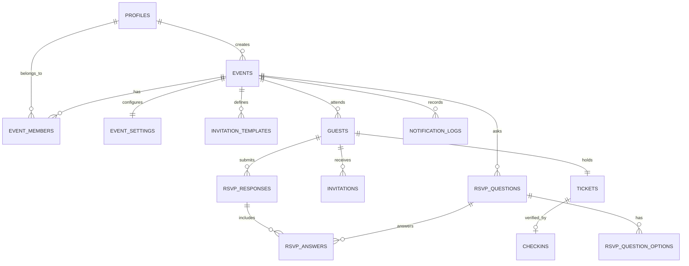

# RSVP Pro — Production-Ready Event Management & RSVP SaaS

A modern, action-focused RSVP and event-management platform inspired by the core workflow of RSVPify, built on a modular monolith architecture with Next.js (App Router), TypeScript, Tailwind CSS, and Supabase PostgreSQL.

---

## Highlights & Capabilities

1. **Event Lifecycle & Publishing**: Configure event dates, timezone, venue location & street address, cover image, and description.
2. **Public RSVP Experience (`/e/[slug]`)**: High-conversion, responsive invitation experience with party headcount, dietary preferences, and custom questions.
3. **Dynamic Question Builder**: Configurable form fields per event (single choice, multiple choice, text, textarea, boolean).
4. **Instant Digital Passes & QR Codes**: Automated ticket issuance with unique QR codes generated for every confirmed attendee.
5. **Gate Check-In Station (`/events/[id]/checkin`)**: Real-time camera QR scanner with `jsqr`, duplicate check-in prevention, manual code entry, and tactile audio feedback.
6. **Live Attendance Intelligence**: Headcount metrics, check-in percentage, capacity progress bar, and instant CSV roster export.
7. **Abstracted Notification Layer**: Scalable email and invitation engine with automated logging to `notification_logs`.
8. **Isolated Data Service Layer**: UI components never touch database queries directly; clean services enforce transactional integrity and server-side validation.

---

## Technology Stack

- **Framework**: Next.js 16 (App Router) + React 19 + TypeScript
- **Styling**: Tailwind CSS v4 + Lucide Icons + Confetti Celebration Engine
- **Database**: Supabase PostgreSQL (Normalized relational schema, RLS, Indexes, Stored Procedures)
- **Validation**: Centralized Zod schemas (`src/lib/validations/`)
- **QR Engine**: Pure-JS `jsqr` camera detection & `qrcode` rasterizer

---

## Database Architecture (Normalized PostgreSQL)

The system is designed with 14 normalized tables:



### Relational Schema Summary:
- `profiles`: Synced with Supabase `auth.users`.
- `events`: Core event records, schedule, cover image, venue, and publish state.
- `event_members`: Role-based access control (`owner`, `admin`, `staff`).
- `event_settings`: Public list visibility, RSVP closure deadlines, notifications, and security PIN.
- `invitation_templates`: Customizable subject lines and email copy.
- `invitations`: Dispatch logs and delivery tracking.
- `guests`: Normalized attendee records, plus-ones allowance, status (`invited`, `pending`, `attending`, `declined`), and unique `qr_token`.
- `rsvp_questions` & `rsvp_question_options`: Dynamic questionnaire builder.
- `rsvp_responses` & `rsvp_answers`: Persisted attendee responses.
- `tickets`: Cryptographically unique ticket codes and QR data payloads.
- `checkins`: Atomic check-in records (`ticket_id` UNIQUE prevents duplicate entry).
- `notification_logs`: Auditable delivery status of all outbound invitations and confirmations.

---

## Local Setup & Quickstart

### 1. Install Dependencies
```bash
npm install
```

### 2. Environment Setup
Copy the example environment configuration:
```bash
cp .env.example .env.local
```

### 3. Run Development Server
```bash
npm run dev
```
Open [http://localhost:3000](http://localhost:3000) to view the application.

### 4. Run Automated End-to-End Tests
```bash
npm run test:e2e
```

---

## Supabase PostgreSQL Deployment

### Running Supabase Locally (with Supabase CLI):
```bash
# Start local Supabase containers (Docker required)
npx supabase start

# Apply database migration
npx supabase migration up

# Populate seed data
npx supabase db reset
```

### Connecting to Hosted Supabase:
1. Create a project on [supabase.com](https://supabase.com).
2. Execute the migration script in `supabase/migrations/20261001000000_init_rsvp_schema.sql` via the Supabase SQL Editor.
3. Update `.env.local` with your project credentials:
   ```env
   NEXT_PUBLIC_SUPABASE_URL=https://your-project-ref.supabase.co
   NEXT_PUBLIC_SUPABASE_ANON_KEY=your-supabase-anon-key
   SUPABASE_SERVICE_ROLE_KEY=your-supabase-service-role-key
   ```
4. The isolated service layer automatically routes all queries to your hosted PostgreSQL database without changing application code.

---

## Security Architecture

- **Row Level Security (RLS)**: Enforced across all user-facing tables.
- **Privileged Credential Isolation**: The Supabase Service Role key is strictly isolated in server-only modules (`src/lib/supabase/admin.ts`) and is never leaked to the client bundle.
- **Double-Layer Duplicate Check-In Prevention**: Handled transactionally with PostgreSQL unique constraints on `checkins(ticket_id)` and checked before record insertion in the service layer.
- **Server Validation**: All submissions pass through Zod schemas before reaching the database.
